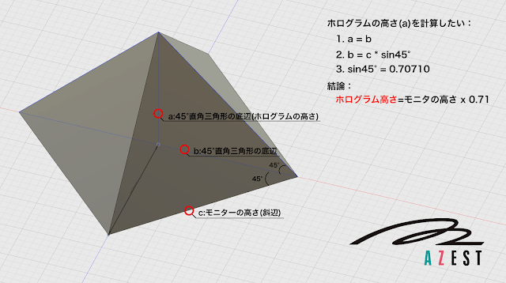

# ホログラムの高さの計算について 

July Tech Festa2018ホログラムを手作りして展示したいという案が上がりました。社内の既に存在するモニターを使ってホログラムを作りたいですが、どんな規模な物が作れるのかを知りたくて、計算してみました。

1. 60°のピラミントを作りたいので、上図に示すような構造となります。
1. 結論というと：ホログラムの高さ = モニターの高さ x 0.71
