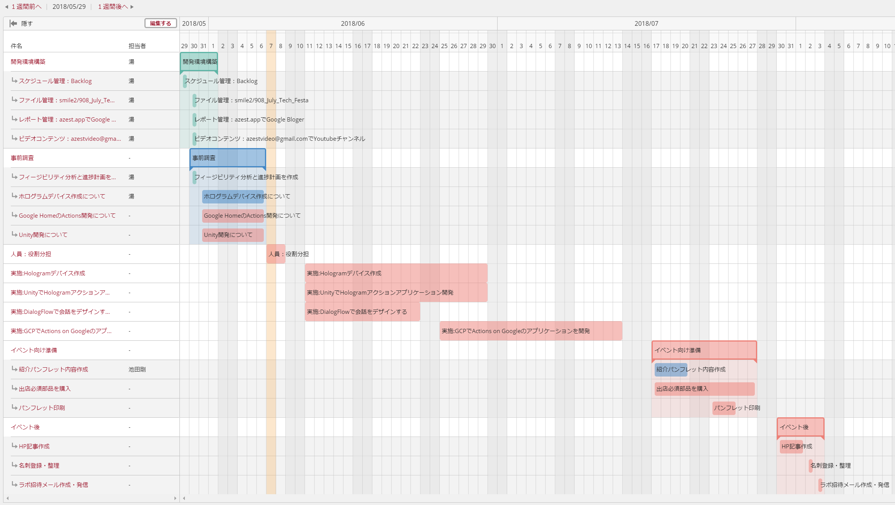

# July Tech Festa 2018出展決定、そしてブース展示についての提案 

今年もJuly Tech Festaにブース出展することが決定しました(拍手👏👏👏)。最高のITエンジニアさんとの出会いを楽しみにしております。  

今年のブース展示物について社内からいろいろな意見を頂いて、そして3案までに絞り込みました。ブースに展示するのは3案の中の1案ですが、それぞれのアイディアが面白いので、ネーターとして披露させて頂きます。

---

## 1.来場者お菓子配りマシン

上図に示すように：  
1. jetson tx2を使って、ブースに来てくれた人に感知します。
1. 人のフェースが感知できたら、ロボットアームにお菓子を渡してあげます。
1. ①で感知したフェース情報(性別、年齢など)をGCPのPub/Subで送信し、Cloud Dataflowでデータプレパレーションし、整理できたデータをBigQuery Tableに保存します。
1. TableauでBigQueryに見て、分析グラフを表示します。

---

## 2.AZEST電子コンシェルジュ

上図に示すように：
1. ブースに来てくれる人から、ホログラフィーでできたコンシェルジュに音声で話しかけます。
1. Google DialogFlowを使って、会話のインテンツ分析します。
1. Firebase Functionsで会話の詳細を処理してレスポンスをフィードバックします。
1. 自動的に処理できない場合、Lineworks Bot Apiを使って、担当者にメッセージを送信します。

---

## 3.Magic Mirror

上図に示すように、童話『白雪姫』の中にある魔法ミラーのようなものです。

---

## 結果：「AZEST電子コンシェルジュ」が当選しました！

これから下図のように、少しつつ作って見ます。最後まで完成できるかどうかはまだ保証できませんが、とにかく精一杯頑張ります～

(開発スケジュール)