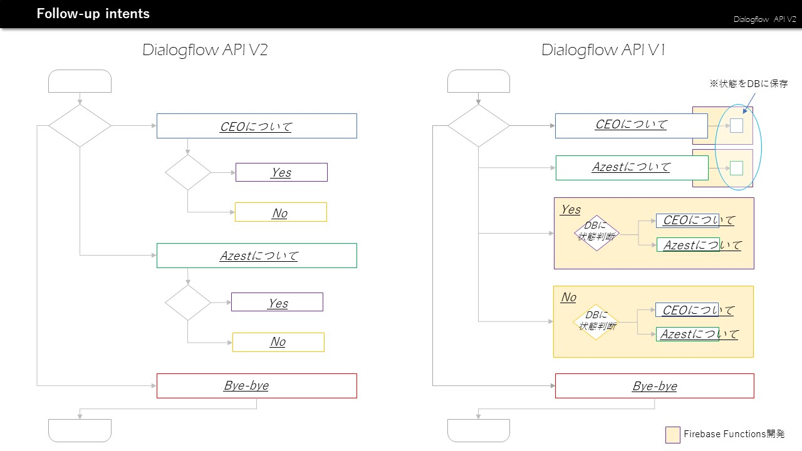
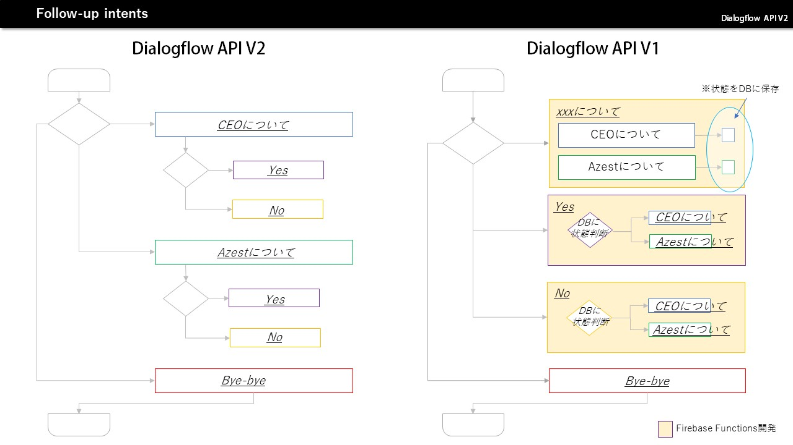
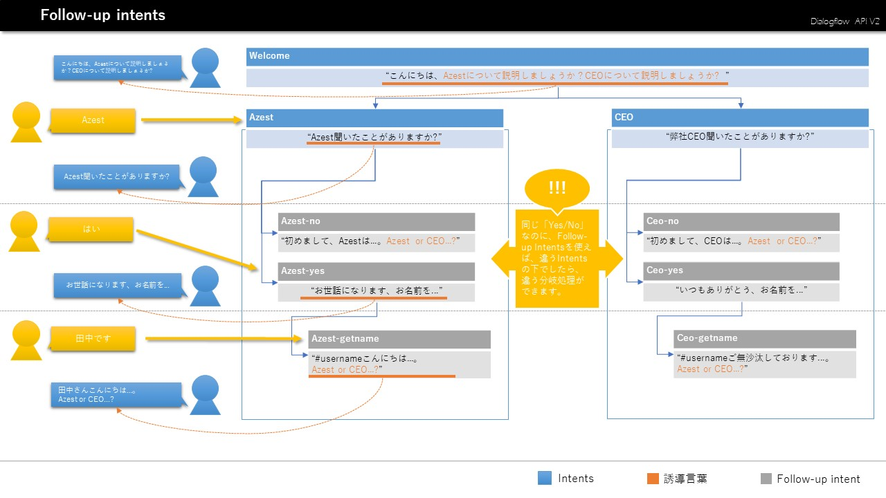

# DialogFlow: 会話分岐処理Follow-up Intents機能について

初めまして、エンジニアの湯(たん)と言います。今年のJuly Tech Festa向けにホログラフィーでの音声システムを作るために、DialogFlowを技術調査しました。

1年前DialogFlowはまだApi.aiと呼ばれる時にすでに使いましたが、1年前と比べるすごく進化したと感じました。色んな変化の中に一番印象強いのは「Follow-up Intents」機能です。

API V1の時に、Follow-up Intents機能がまだなかったのため、分岐処理をかなり大変でした。上図に示すように、API V1ではすべての「Yes」とすべての「No」は必ず独立のIntentに設定し、前の会話状態を判断して結果をフィードバックするソースコードを組めないといけませんでした。

それに対して、API V2のFollow-up Intens機能を使えば、ソースコードを書かず、DialogflowのWeb UI上で全部設定できます。

(Follow-up Intents設定イメージ)

Follow-up Intents機能を使う具体例：

