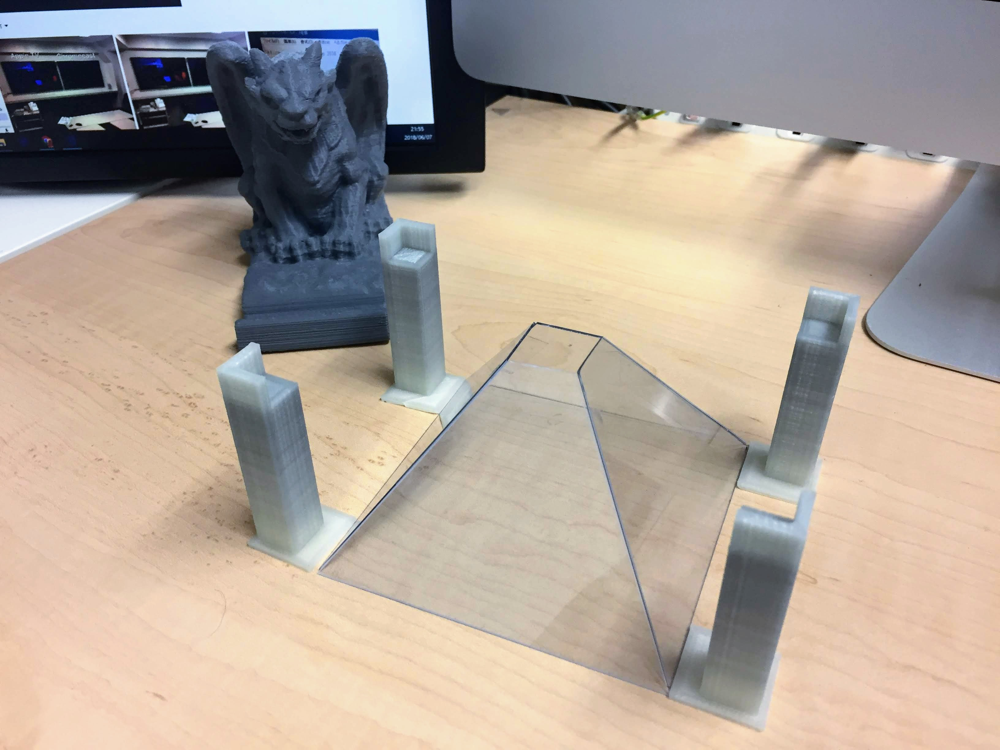
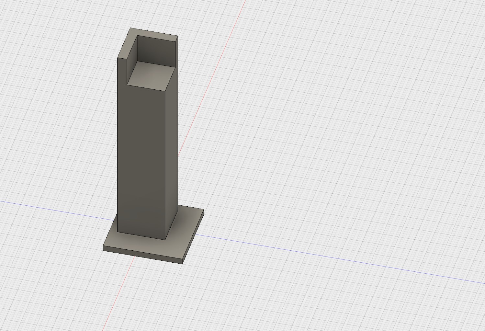
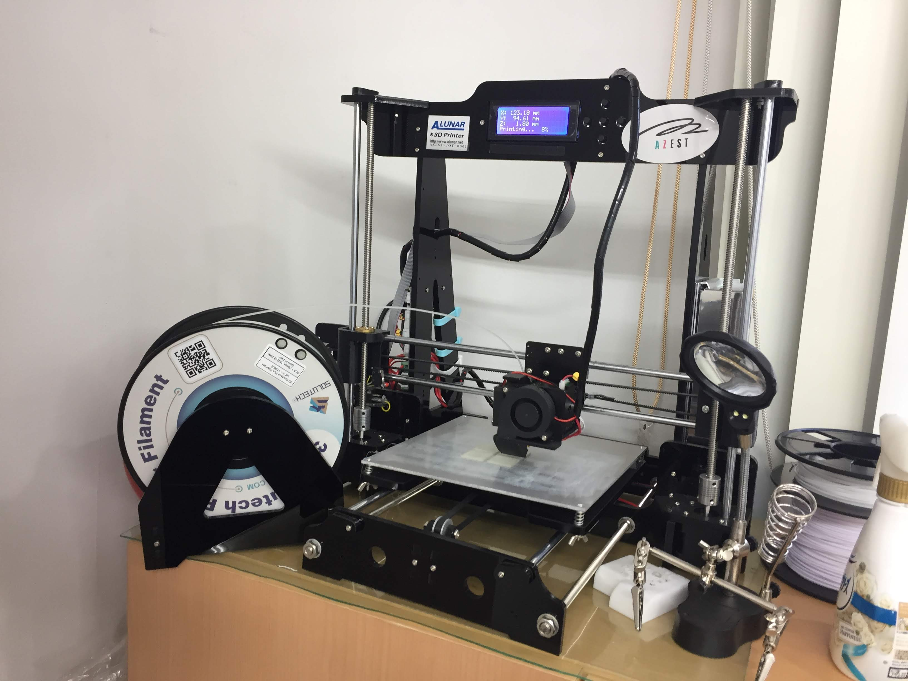

# 検証用小型ホログラム装置を作ってみました

「ホログラムの高さの計算について」を引継いて、まずiPadサイズのものを試して作ってみました。

ホログラムの材料は百円ショップで買った「硬質カードケースA4サイズ」の一枚でした。そしてiPadを支えるために、CADソフトで支柱を設計し、3Dプリンターで出力しました。

実際の動き映像をご覧ください。

[IMG_0371.MOV](IMG_0371.MOV)

検証用小型ホログラム装置が無事に作成できました。この経験をいかして、次は32インチのでかいモニターバージョンの装置を作りますんで、どうぞお楽しみにしてください。