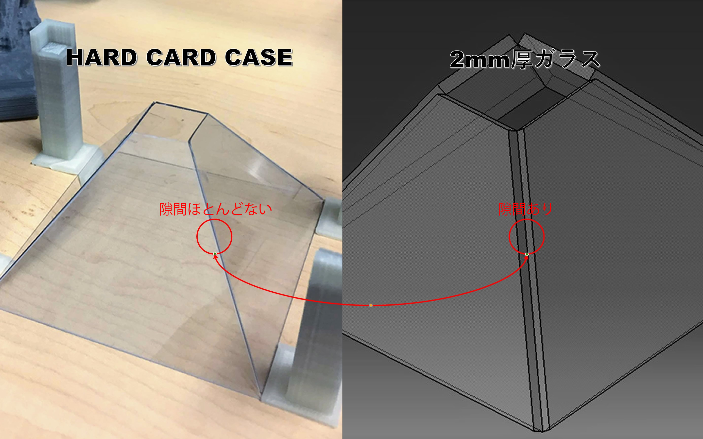
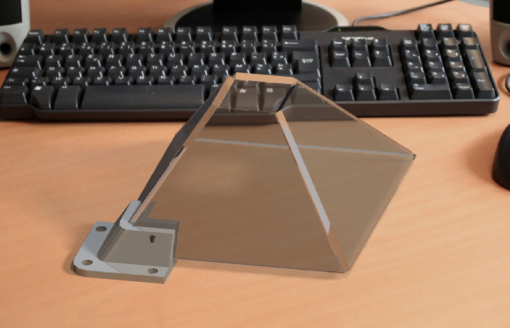
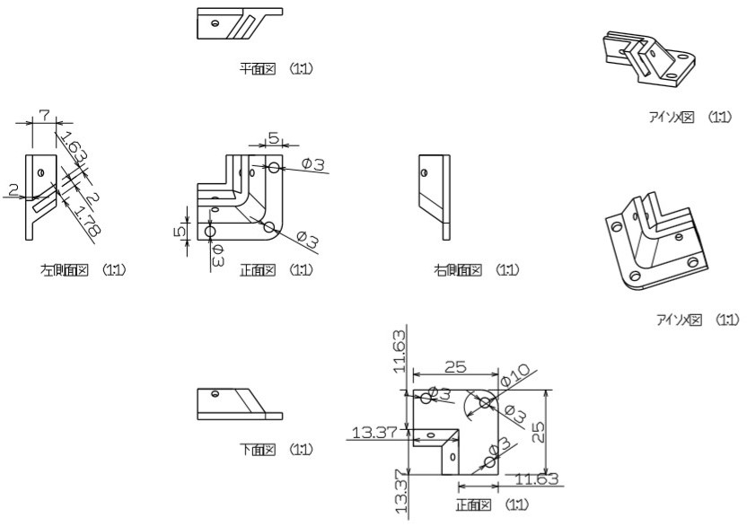

# 固定用パーツをCADで設計してみました

この間百円ショップで買った硬質カードケースで簡易ホログラム装置を作ってみました。  
これから大型の物を作ろうとしまして、硬質カードケースではなく、まず2mm厚のガラスを使おうと思います。  
そこで上図に示すような問題に出会いました：ガラス板とガラス板の接続問題

いろいろ試行錯誤にわたって、まずVer1の固定用パーツを設計してみました。  
正直に言うと、CADで閉鎖的な四角錐(しかくすい)体を作るのやや難しいのうえ、板を接続するようなモデルを作るのは難しかったです。  
その上に一つの角を固定するパーツを設計するのは大変でした。  
というわけで、皆さんの参考のため固定用パーツのドラフティング図をシェアします↓↓↓

