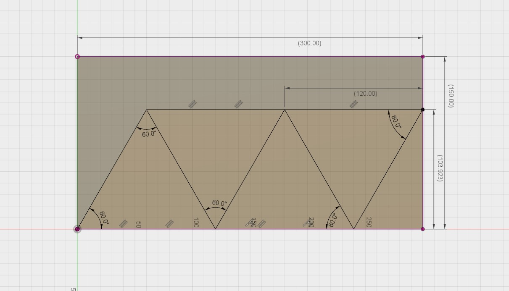
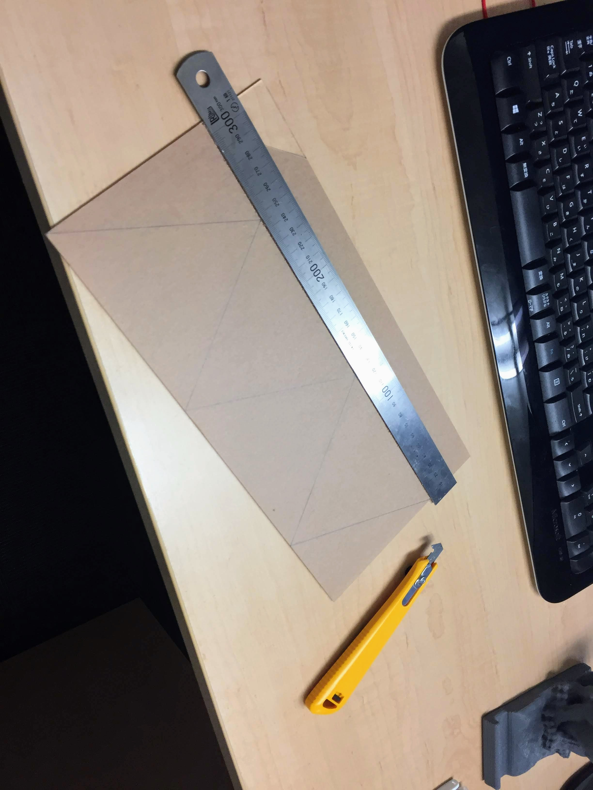
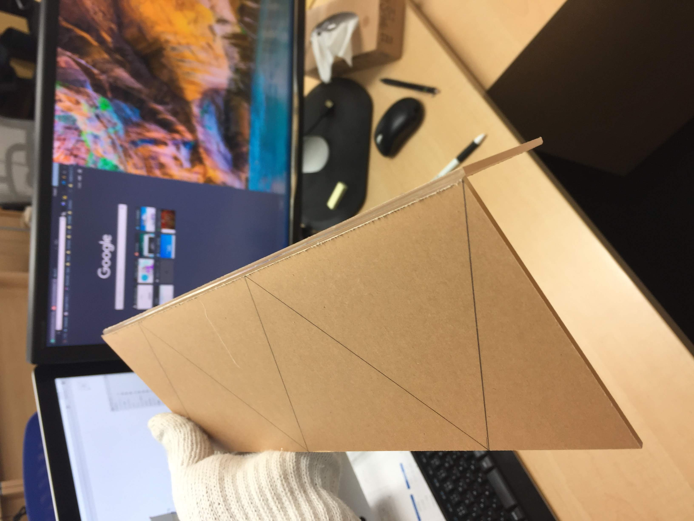
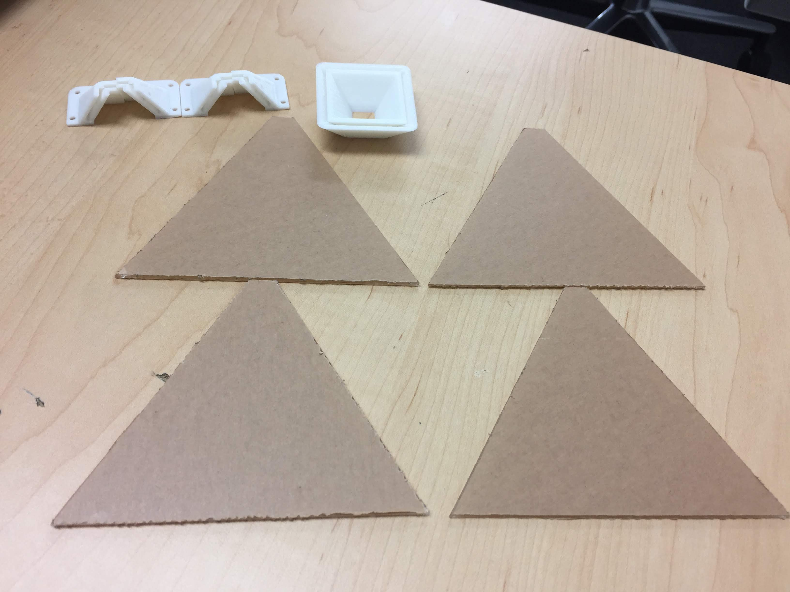
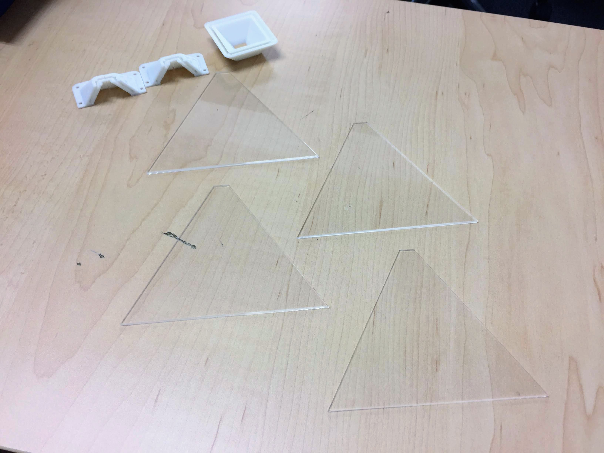
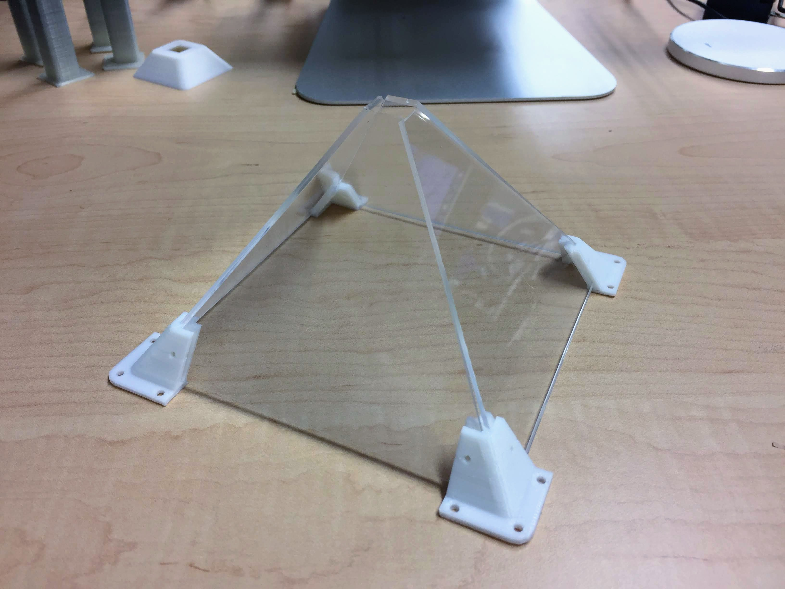

# 2mmアクリル板で作ってみました

先週固定パーツを2mm厚用固定パーツを設計しました。早速ながら東急ハンズで2mm透明アクリル板(150*300)を購入し、ホログラムのアクリル板バージョンをもう一回作ってみました。

4つの正三角を作りたいので、上記の寸法でカートしようと思います。

カートする時に、危ないので普通のカーターは絶対に使わないでください。上図のようにアクリルカーター(右黄)を使ってください。

同じ方向でアクリルカートを10回ぐらいに削ると、バシッと綺麗に分け割れるので、超気持ちいいです。

4つの正三角をカートできました。

そして保護フィルムを外して、組立て見よう～

ジャンジャン、粘着剤一切不要で組立ました。この固定パーツを使うと意外に便利でした。

が。。。まだ新たな問題が出てきました。

アクリル板で作られたホログラムデバイスをiPadに照らしてみたら、この間Hard Cardで作ったものより映像がぼやけています。

よりクリアな映像を移したいため、どうすればよいのか？まだ試行錯誤してみます。解決案を見つかったら、まだここに報告しに来ます。どうぞお楽しみにしてください。