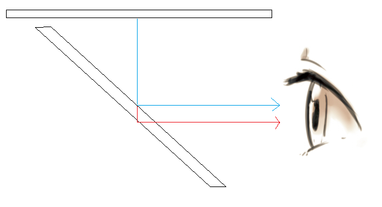
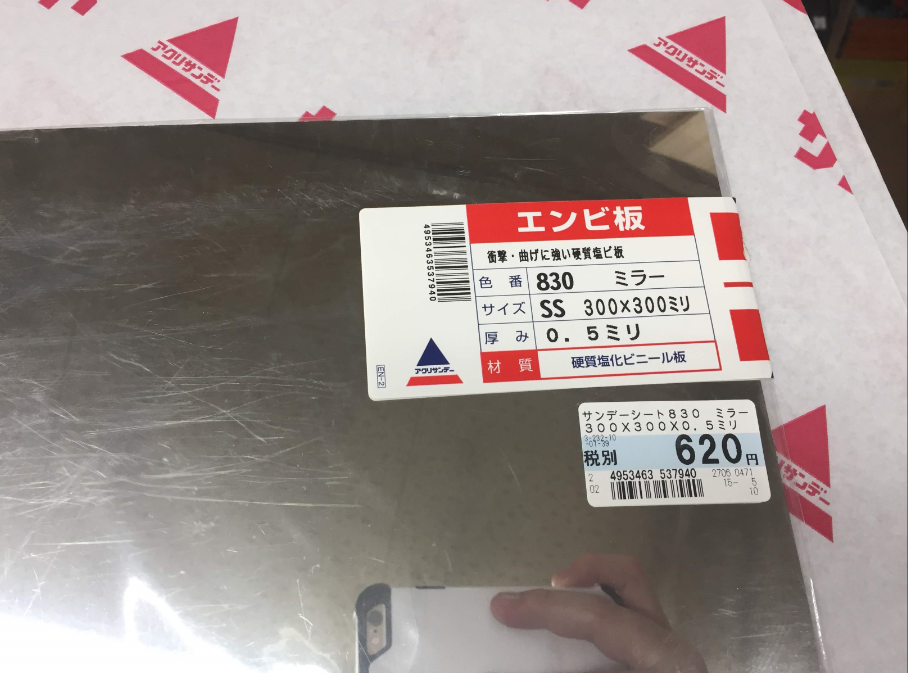

# 2mmアクリル板ぼやけ問題について

上図に示すように、2mmアクリル板を使って映像がぼやける問題は、アクリル板の厚さで、光が異なる場所で2回反射することで目が見づらくなります。

どう解決しようと悩みながら、ホームセンターで↑↑↑を偶然に見つかりました。2mmアクリル板と0.5mmミラーエンビ板を重ねればもしかして、行けるはず。。。

とにかくトライアル・アンド・エラーが大事で、これから実験します。結果をまだのちほど～