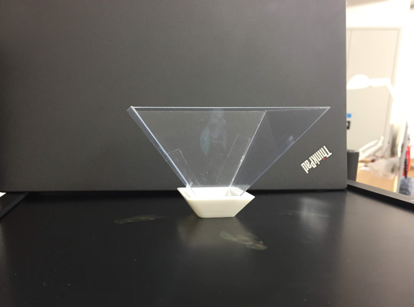
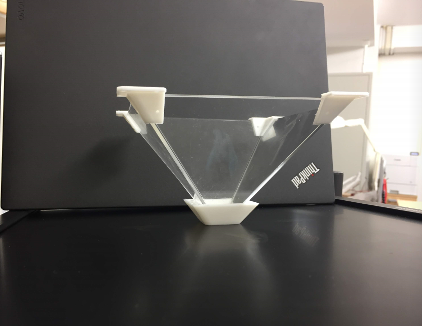
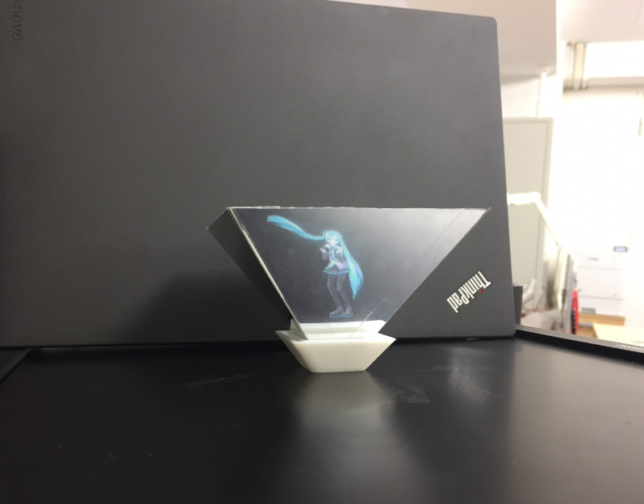
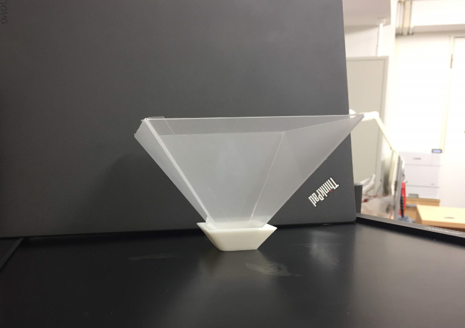
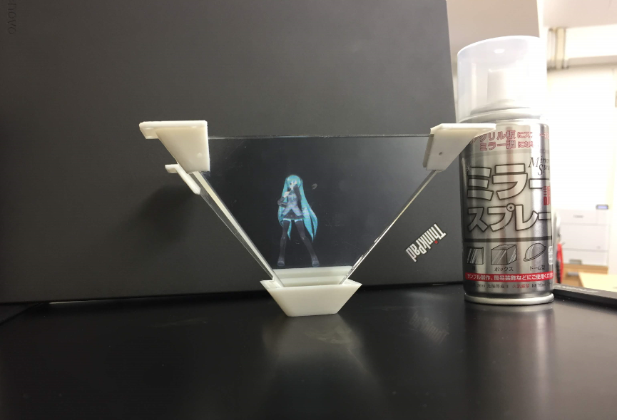

# ホログラム装置コンテンツ＆内部選定

百円ショップHardCard、2mmアクリル板、ミラーエンビ板、そしてプロジェクター用ディラッドスクリーンを４つなホログラム検証用装置を作成しました。一体どれがいいのかを内部審査します・

A案：百円ショップHardCard: 室内光があると、やや見えずらいです。

B案：2mmアクリル板：ほぼ見えないです。

ミラーエンビ板：室内光があっても、綺麗に映られます。。。が、やっぱりC案：0.5mmが薄いので、歪みが出てきました。

D案：プロジェクター用ディラッドスクリーン：残念ながら、全然反射されません。小型DLPプロジェクターを投影すると、反射でなく斜面に投影するだけで、効果がありません。

４つの中、満点となる物がない、どうすればいいかな。。。と悩む間、下図のすご～い物を発見しました：「透明アクリル板用ミラースプレー」。

E案：透明アクリル板用ミラースプレーを2mmアクリル板に使うと、ちゃんと映られるようになったとともに、2mmアクリル板の硬さで歪みが表しません。

結果発表：「E案-2mmアクリル板に透明アクリル板用ミラースプレー」が採用されました！

ホログラム装置の調査も終わり、明日からいよいよ本番向けのでかい装置を作ります。ワクワクします～

一体どんなものを作られるかをどうぞご期待ください。