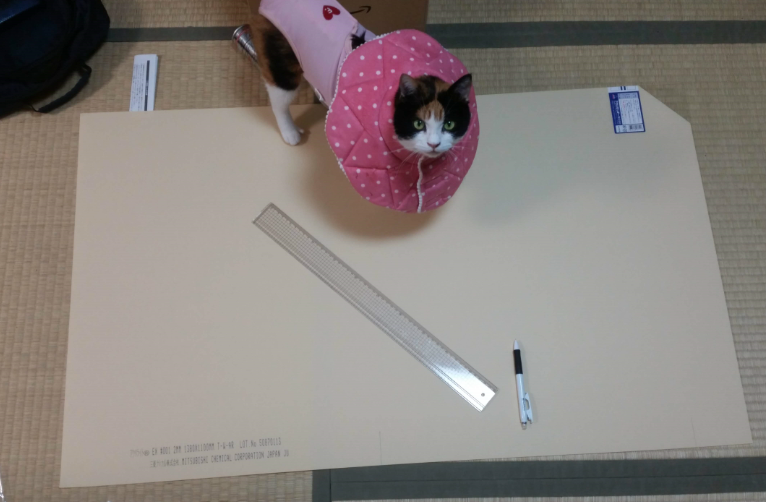
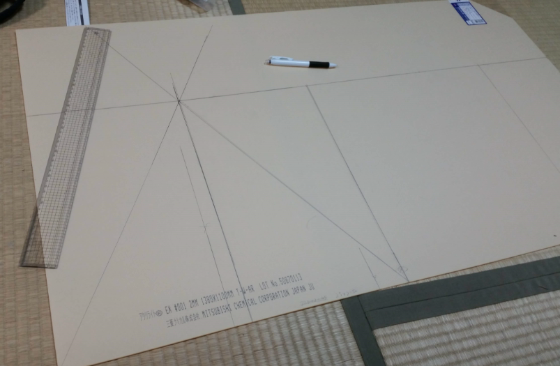
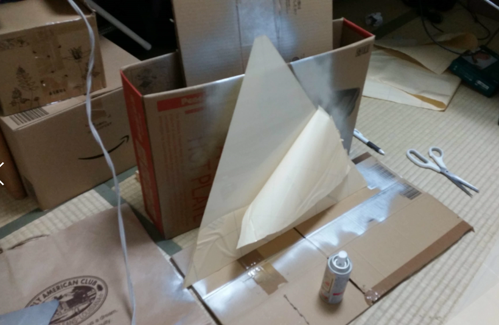
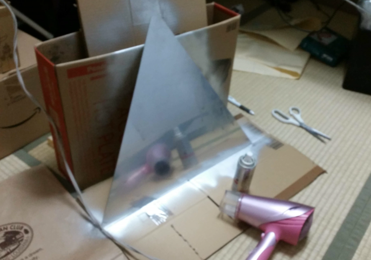
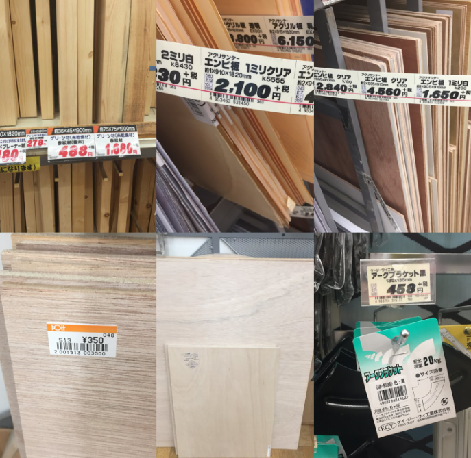
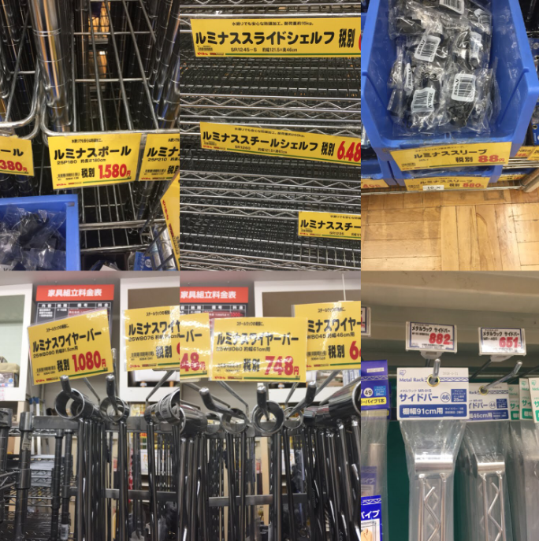
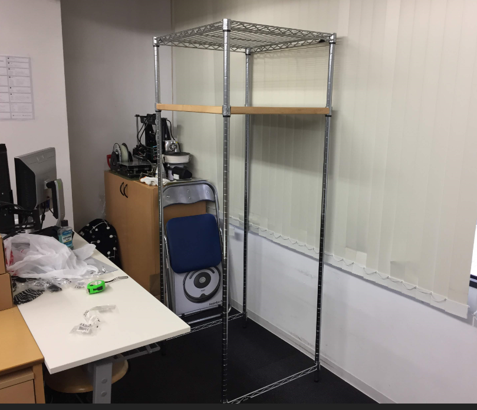

# 本番用ホログラム装置を作成

本番用ホログラム装置を作成するために、まず2mmアクリル板で大きいピラミッドを作ります。底辺500mmのものを作りたいので、ホームセンターで620mmx1000mmが買いました。。。が、大きすぎてそのまま電車に乗り会社へ行けないので、カットしてから持ち込もうと思って、今回家で作業させていただきます。

1.まずカットしようとするサイズを計算して、アクリルカッターでカットします。小物と違い、ずれないように、定規をしっかり押してカットするのはコツです。

2.カットしたら、アクリル板の一面の保護フィルムをはずして、ミラースプレーを塗ります。ミラースプレーを下向き噴射するのは厳禁のため、上図のように立てて噴射してください。そしてかなり匂いますので、窓開けや扇風機を回してください。

3.ミラースプレーで一枚3回ぐらいをシューします。そしてエアドライバーのCoolモードで干します。干してからさらに30分を寝かしますと完成です。

そして、ホログラム装置を支える棚が用意しないと行けないので、そこでまだ2案が出されました。

A案-木材でDIYする：制作コスト安いの一歩、イベント会場への搬入が大変になります。

B案-ルミナスで組み立てる：木材よりかなり高いですが、簡単にばら撒くので、一つのカバンがあるさえ搬入できるのでいいかもしれません。

結果：幸いに一番高価なルミナススライドシェルフの備品が会社に2枚があったので、B案と決定しました。

上図のように、180cmのルミナスボールだけを買って組み立てました。(4本だけでもかなり重いので、ホームセンターから会社まだの間、すごく大変でした～。。。そして、暑いです~T_T)

アクリル板が一枚足りないため、これから買いに行きます。間もなく完成しますので、どうぞお楽しみにしてください。