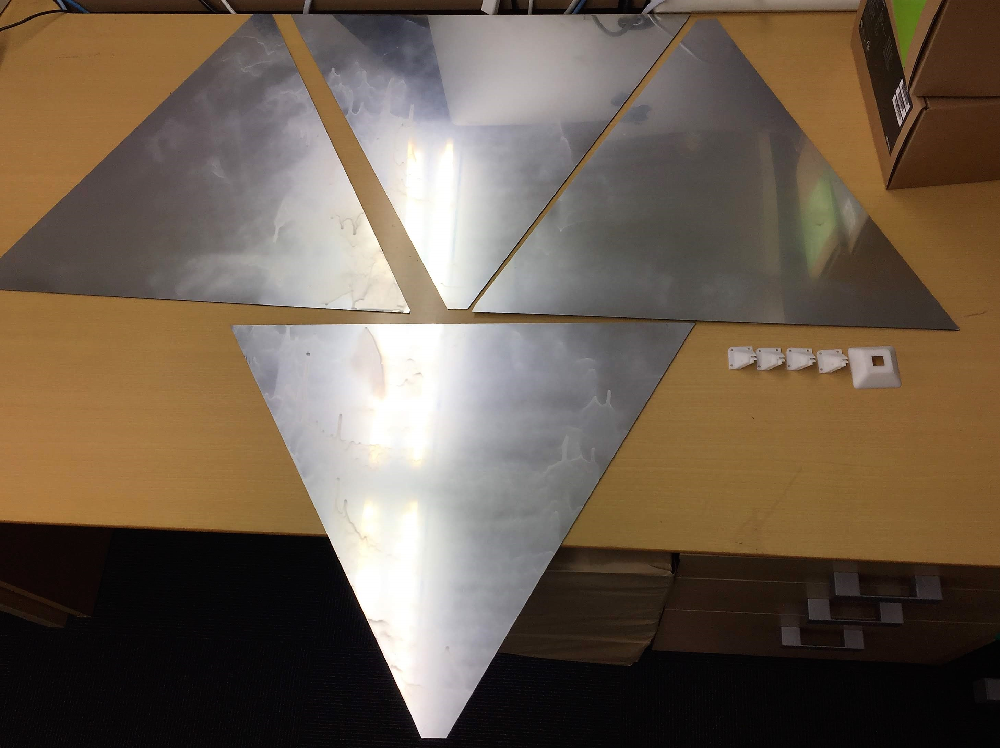
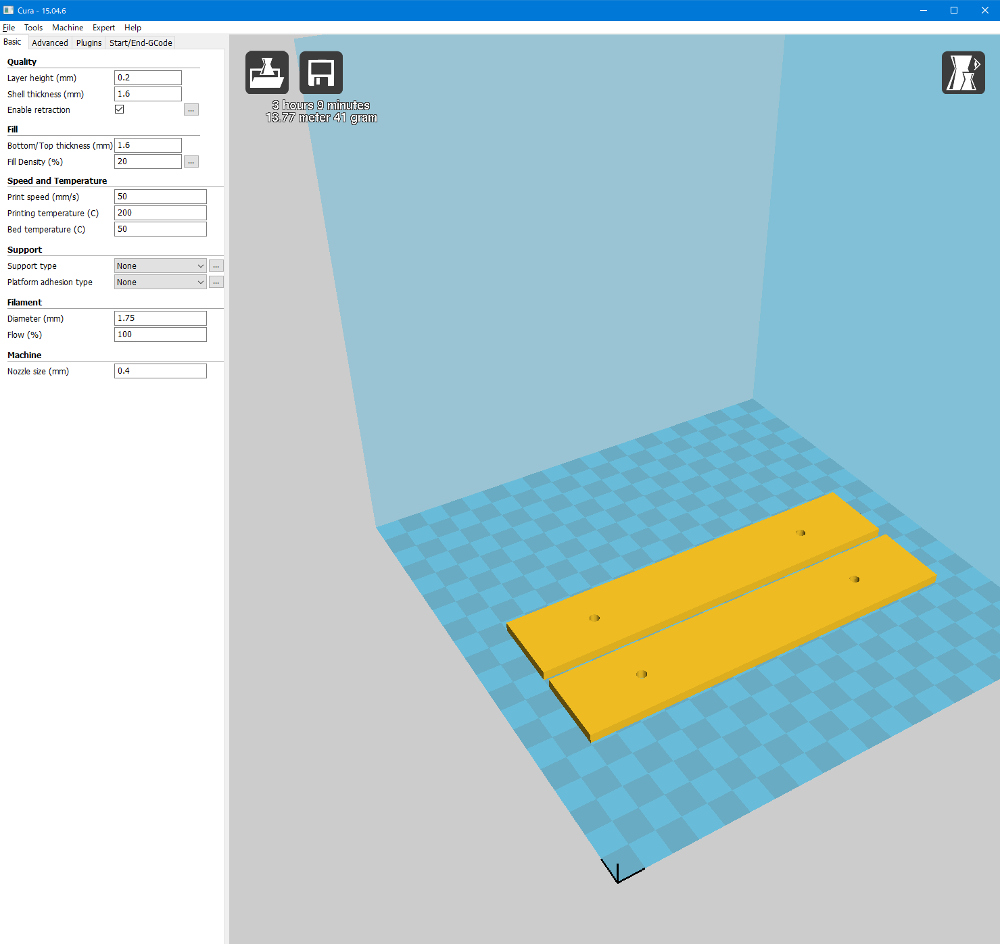
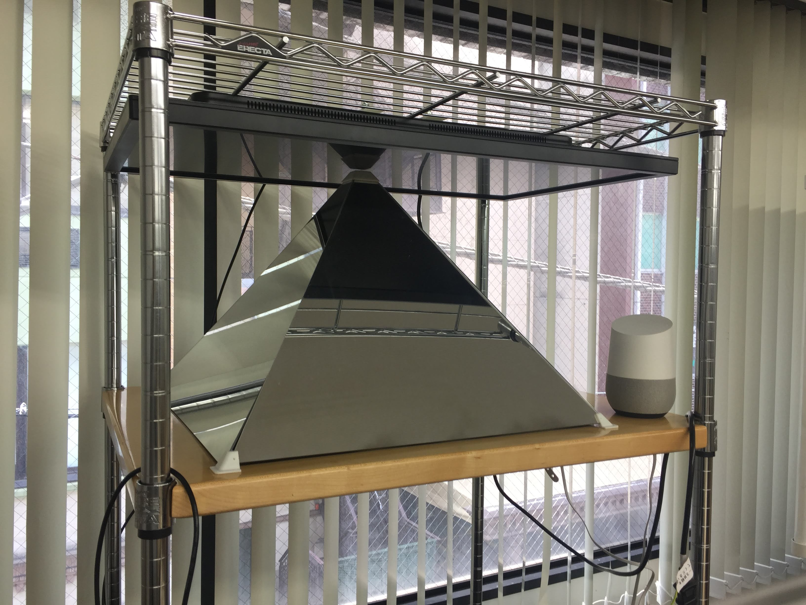
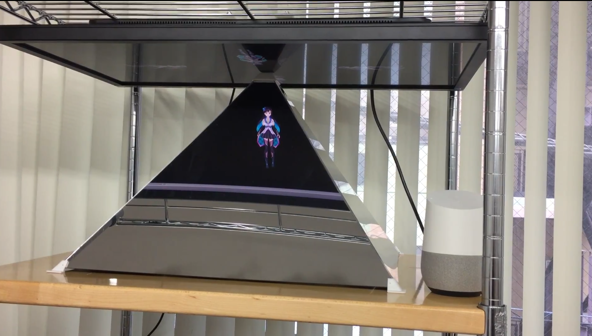

# 本番用ホログラム装置を組み立て

4枚の処理済みのアクリル板を揃えました。さって、前に設定したパーツで組み立てしましょう。

。。。が、さておき、組み立ての間にモニターを固定するパーツも印刷しておきましょう。

穴ピッタリです。そして5mmの厚さですので結構頑丈です。

ホログラム装置も組み立てました。やっぱり大きいで迫力が感じます。

では、点灯しましょう。。。まぁまぁ悪くないです。やっはりもっちょい大きいめのモニターを使えば良いかもしれません。ファーストステップとして十分だと思います。これから余裕があればどんどん拡張しに行きましょう。