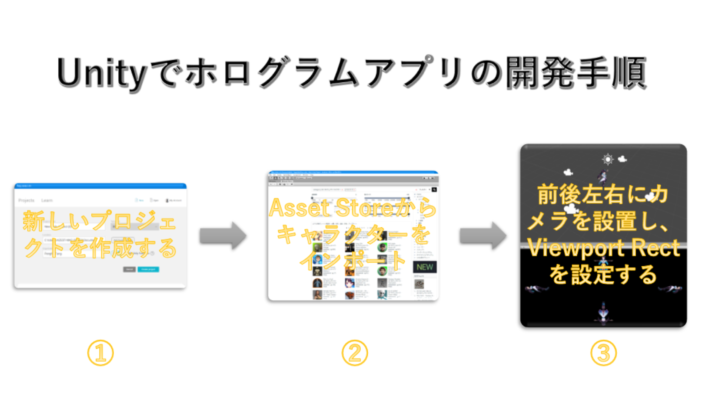
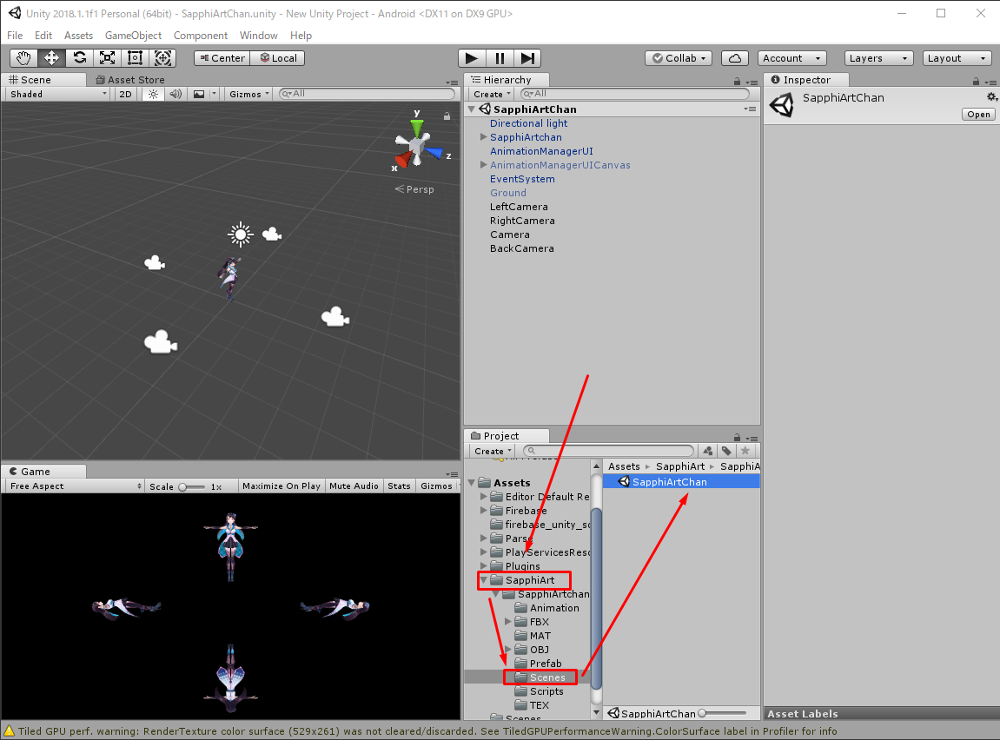
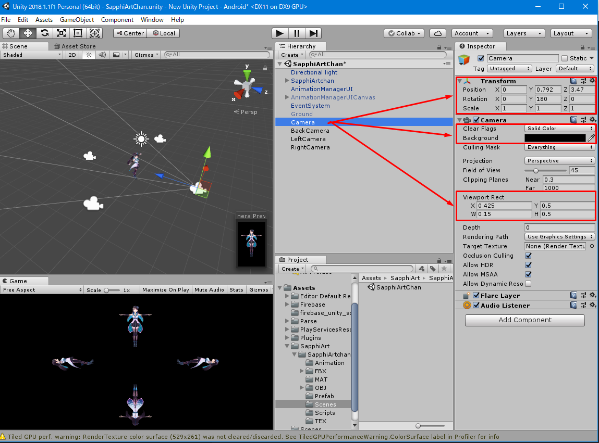
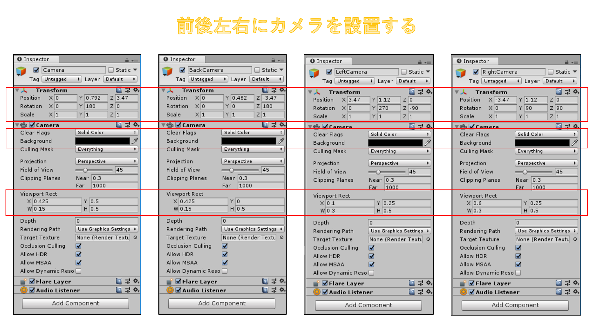
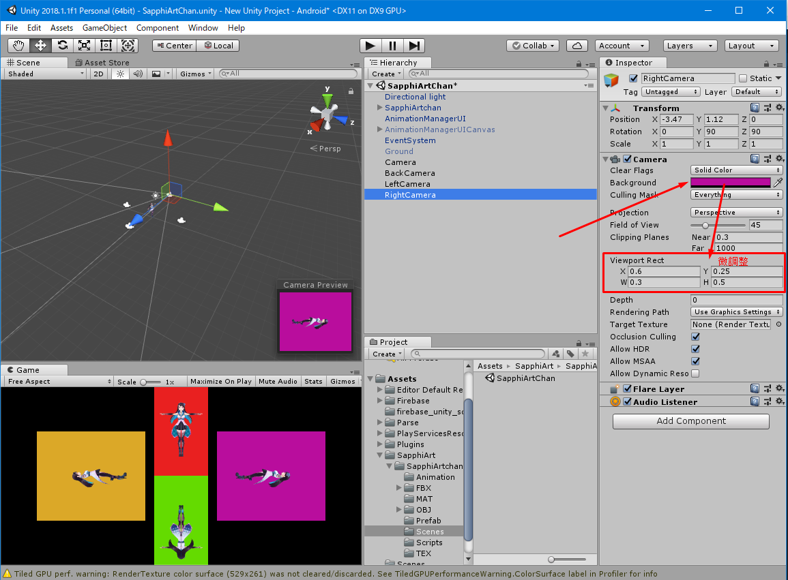

# Unityでホログラムアプリを開発します

上図に示すように、Unityでホログラムアプリを開発すると、まず3ステップが必要となります：

1.Unityの新しいプロジェクト(3D)を新規作成する  
2.Asset Store(Ctrl + 9)からキャラクターをインポートする  
3.メインカメラ以外(前カメラ)、後・左・右にもカメラを設置し、カメラのViewport Rect(分割表示範囲)属性を設定する

技・その一：Unityでキャラクターにアニメーションを設定するのは、僕のような素人に対してかなり難しいですので、幸いにインポートされたキャラクターフォルダの中に「Sences」というお試す用シーンがほとんどあります。それにベースとして開発すると事半功倍となります(事半功倍:半分の労力で倍の成果を得る)。

技・その二：前後左右のカメラを設置するんですが、一体どれを設定すればよいにかを迷い時に上図をご覧ください。  
1.Transform:カメラの座標と角度  
2.Camera(Clear Flags&Background):カメラの環境色
3.Viewport Rect:分割表示範囲

そして、前後左右のカメラの設定の詳細情報を下図にまとめました：

技・その三：Viewport Rect(分割表示範囲)を微調整するとき、下図のように、前後左右のCameraのBackgroundの色をまず違う色をセッティングしておいた方が調整しやすいです。

取り敢えず、Unityでホログラムアプリを開発するときの手順と注意点を書きました。ソースコードをGithubにアップロードしました。ご興味があるかたどうぞご覧ください。

https://github.com/FlySnowIII/jtf2018azest

